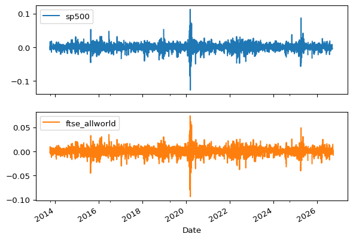
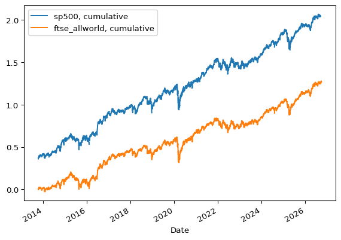
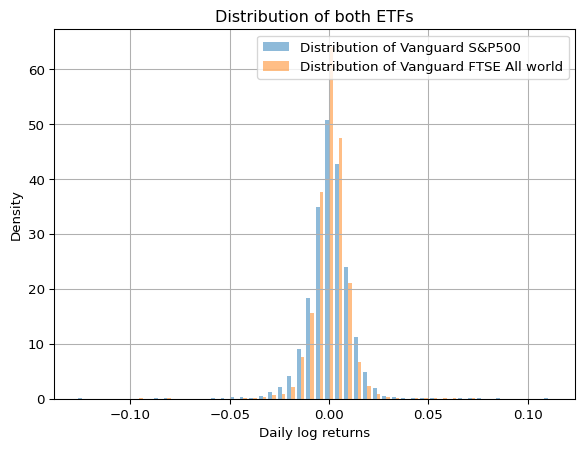
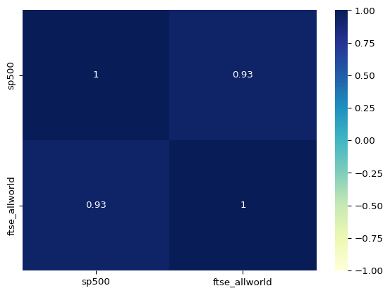
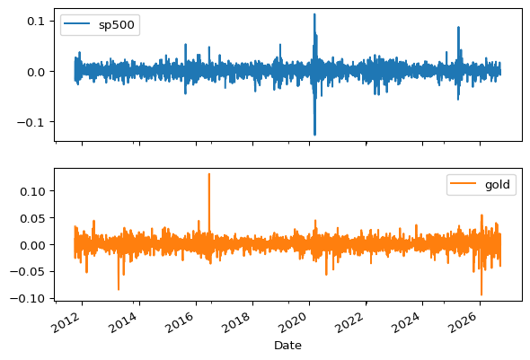
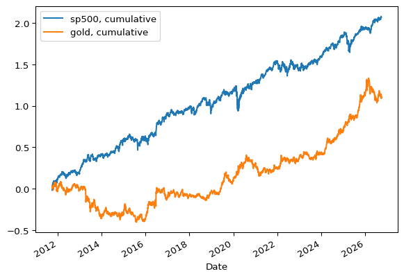
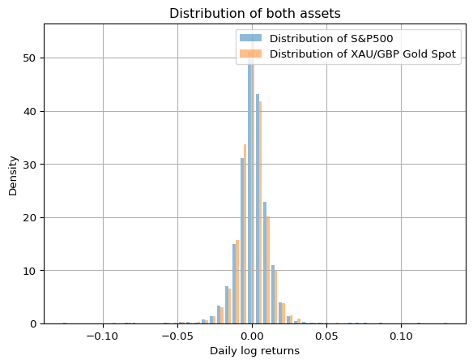
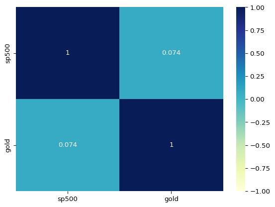
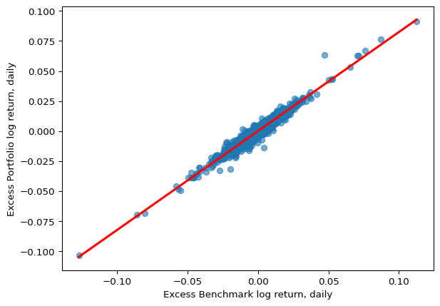
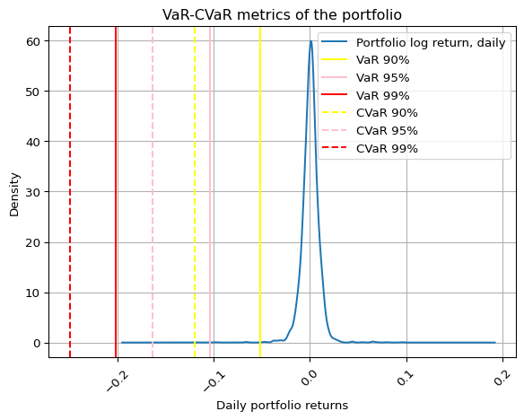

# Portfolio Optimisation Project
Oleh Burdukov
2026-10-03

- [<span class="toc-section-number">1</span>
  Introduction](#introduction)
- [<span class="toc-section-number">2</span> Portfolio
  analysis](#portfolio-analysis)
  - [<span class="toc-section-number">2.1</span> Portfolio
    details](#portfolio-details)
  - [<span class="toc-section-number">2.2</span> Initial data
    manipulations](#initial-data-manipulations)
  - [<span class="toc-section-number">2.3</span> Returns plots and
    statistics](#returns-plots-and-statistics)
    - [<span class="toc-section-number">2.3.1</span>
      Findings](#findings)
  - [<span class="toc-section-number">2.4</span>
    Correlation](#correlation)
  - [<span class="toc-section-number">2.5</span> Portfolio
    performance](#portfolio-performance)
- [<span class="toc-section-number">3</span> Optimised portfolio
  analysis](#optimised-portfolio-analysis)
  - [<span class="toc-section-number">3.1</span> Returns plots and
    statistics](#returns-plots-and-statistics-1)
  - [<span class="toc-section-number">3.2</span> Findings](#findings-1)
  - [<span class="toc-section-number">3.3</span>
    Correlation](#correlation-1)
  - [<span class="toc-section-number">3.4</span> Portfolio
    construction](#portfolio-construction)
- [<span class="toc-section-number">4</span> Risk
  analytics](#risk-analytics)
  - [<span class="toc-section-number">4.1</span> Market
    risk](#market-risk)
    - [<span class="toc-section-number">4.1.1</span>
      Findings](#findings-2)
  - [<span class="toc-section-number">4.2</span> Value-at-Risk
    analysis](#value-at-risk-analysis)
- [<span class="toc-section-number">5</span> Conclusion](#conclusion)

# Introduction

This is a project on Portfolio Optimisation. It was created to practice
freshly acquired skills in Python that I had been learning in Summer
2026. The main goal was to consolidate my knowledge of Python through a
basic financial engineering application. While the topic is one of the
classiest assignments in quantitative finance, I aimed to push the scope
by integrating as many technical skills and analytical techniques as I
could.

The portfolio analysed in this work was provided to me by a personal
contact. Taking this opportunity, I’d like to express my big gratitude
to this person. Bellow, I will first introduce the portfolio and then
present my work step by step shortly explaining what I did in every part
of my code.

# Portfolio analysis

## Portfolio details

The portfolio I was given had been in possession of the owner for around
the last six months. The owner was keen on investing into largely
diversified ETFs that track some of the most famous market indices. In
particular, she had 2 assets in her portfolio, namely Vanguard’s ETFs
for S&P500 and FTSE All-world indices. The weightings were 13,54% for
S&P500 and 86,46% for FTSE All-world. The main concern that has come up
on my end after the first quick analysis involves the risk statistics of
both assets, mostly regarding correlation of both assets. Due to this
issue, I suggested conducting a portfolio analysis with further
diversification goal.

It is important to note, that both acquired ETFs have been traded on the
market approximately for the last 7 years. This means for us that we
require some appropriate proxies for both assets, as the present time
series are not long enough for a sufficient analysis. Since our
investments track well-known indices, we have no problem to download 15
years of data to conduct a robust research for our purposes. Later,
we’ll merely have to appreciate for some additional costs for services,
when adjusting our final results. In order to verify reliability of this
approach, you can check on past performance in ETFs’ documentation.

There is another important detail regarding such proxies. All of them
are initially presented in dollars. Since portfolio owner is a UK
resident, we have to appreciate for GBP/USD rate, as all presented
assets in the analysis have no hedge against FX risk. Here is to note,
that the FX rate dataset used for this purpose has GBP/USD indirect
quote, i.e., price for one GBP in dollars.

## Initial data manipulations

For a start, let’s import the data:

``` python
GBPUSD = pd.read_csv('Proxies/GBP_USD Historical Data.csv', parse_dates = ['Date'], index_col = 'Date', thousands = ',', na_values = 'n/a').sort_index(ascending = True) # import of GBP/USD indirect quote
sp500 = pd.read_csv('Proxies/S&P 500 Historical Data.csv', parse_dates = ['Date'], index_col = 'Date', thousands = ',', na_values = 'n/a').sort_index(ascending = True) # import of S&P500 proxy
ftse_allworld = pd.read_csv('Proxies/FTSE All World Historical Data.csv', parse_dates = ['Date'], index_col = 'Date', na_values = 'n/a').sort_index(ascending = True) # import of FTSE All world proxy
```

I have shaped the data into appropriate time series for the further
analysis, e.g., I’ve set the Date column as an index, sorted the whole
table by it and addressed the missing values in the data frame.

Next, we’d like to create the return columns. Since we’ll perform
modelling for required inference, it’d be better to make use of
continuous returns, i.e., log transform the simple returns column once
it’s computed. Additinally, we estimate also a cumulative log returns
column for the plotting purposes.

``` python
GBPUSD['Return, daily'] = GBPUSD['Price'].pct_change(periods = 1)

sp500['Return, daily'] = (sp500['Price'].pct_change(periods = 1).add(1)).div(GBPUSD['Return, daily'].add(1)).sub(1) # simple returns
sp500['Log return, daily'] = np.log(sp500['Return, daily'].add(1)) # log returns
sp500['Cumulative log return, daily'] = np.cumsum(sp500['Log return, daily']) # cumulative log returns

ftse_allworld['Return, daily'] = (ftse_allworld['Price'].pct_change(periods = 1).add(1)).div(GBPUSD['Return, daily'].add(1)).sub(1) # simple returns
ftse_allworld['Log return, daily'] = np.log(ftse_allworld['Return, daily'].add(1)) # log returns
ftse_allworld['Cumulative log return, daily'] = np.cumsum(ftse_allworld['Log return, daily']) # cumulative log returns
```

At this point it was noticed that FTSE All world index starts a bit
later than 15 years ago. We assume it doesn’t corrupt analysis and
allign length of both time series

``` python
sp500 = sp500.loc['10/14/2013':'09/15/2026'] # cutting the data
```

## Returns plots and statistics

Now, as we have successfully maintained the data, we are good to
construct some plots and observe statistic tables for the assets
analysis.

``` python
LogReturnsData = pd.DataFrame({'sp500' : sp500['Log return, daily'],
                               'sp500, cumulative' : sp500['Cumulative log return, daily'],
                               'ftse_allworld' : ftse_allworld['Log return, daily'],
                               'ftse_allworld, cumulative' : ftse_allworld['Cumulative log return, daily']}) # Assignment of the log returns dataframe for further modelling manipulations
```

We are going to plot returns by 2 graphs, one for log returns themselves
and one for the cumulative representiation.

``` python
LogReturnsData[['sp500', 'ftse_allworld']].plot(subplots = True) # plot of simple log returns
plt.show()
LogReturnsData[['sp500, cumulative', 'ftse_allworld, cumulative']].plot(kind = 'line') # plot of cumulative log returns
plt.show()
```





As we may read it from the plots above, the correlation between both
ETFs is drammaticaly strong. Such investment allocation may be as
successful as investment in only one of both assets. Obviously, we are
going to see similar picture on the following statistic tables.

In order to obtain all necessary values for sufficient analysis, we’ll
assign first table by means of the .describe() method and second using
.agg() . Additionally, we’ll annualise mean return and standard
deviation.

``` python
statistics1 = LogReturnsData[['sp500', 'ftse_allworld']].describe() # descriptive statistics
print(statistics1)
statistics2 = LogReturnsData[['sp500', 'ftse_allworld']].agg(['median', 'var', 'skew', 'kurtosis']) # descriptive statistics
print(statistics2)

annual_mean = np.exp(statistics1.loc['mean'].mul(252)).sub(1) # reverse the log transformation and annualise return
print('annual mean values are:\n', annual_mean)

annual_std = statistics1.loc['std'].mul(np.sqrt(252)) # annualise standard deviation value
print('annual standard deviation values are:\n', annual_std)
```

                 sp500  ftse_allworld
    count  3249.000000    3378.000000
    mean      0.000517       0.000375
    std       0.010977       0.008516
    min      -0.126842      -0.093779
    25%      -0.004600      -0.003628
    50%       0.000884       0.000612
    75%       0.006153       0.004814
    max       0.112564       0.073736
                  sp500  ftse_allworld
    median     0.000884       0.000612
    var        0.000121       0.000073
    skew      -0.308484      -0.723854
    kurtosis  15.768773      14.134924
    annual mean values are:
     sp500            0.139041
    ftse_allworld    0.099238
    Name: mean, dtype: float64
    annual standard deviation values are:
     sp500            0.174259
    ftse_allworld    0.135194
    Name: std, dtype: float64

Portfolio owner asked me to optimise it, such that a better of two
assets stays on the books. At this point, we need to choose one of the
assets based on descriptive statistics, in order to substitute a worse
investment with an alternative.

### Findings

Fisrt finding that we can see is negative skewness of both indices.
These values basically say that while retruns are mostly placed around
mean and are positive, considerable share of outliers in the data is
negative, i.e., ususally market shocks lead to some big falls in value,
not to its rises. Preferably, we want to have assets with positive
skewness, but in these terms, S&P500 is what we may keep working with
later.

Furthermore, kurtosis value of each ETF appears to be very large.
Ideally, we’d have a value arround 3, but the present distributions’
kurtosis says it is pretty much leptokurtic, which means tails are
longer and thicker, and central peak is higher and sharper. In fact,
this is more than possible, considering the issuer of both tracking ETFs
states level of risk 6 out of 7 in the documentation. Later, you’ll be
able to observe this issue on the distribution plot.

Taken together, the picture we observe in both tables allows us to state
the following: the kurtosis coefficients correspond to what one can
observe in the minimum and maximum values of both series. The outliers
of S&P500 extend further from the mean, than those of FTSE All-world. It
also relates to what we can read from lower and upper quartile of
distributions. Perhaps, more negative skewness of FTSE All-world
indicates a higher share of losses among the outliers, whereas the
skewness of S&P500 does not raise such concerns and appears more
promising in light of the above facts.

Last but not least, what one can make some conclusions from is mean and
standard deviation of both assets. Comparing both ETFs, we notice that
S&P500 has relatively high volatility of 17%, even if the mean return is
greater than that of FTSE all-world.

Now, we can summarise the observation by distribution plot

``` python
plt.hist(x = LogReturnsData[['sp500', 'ftse_allworld']], 
         bins = 50, 
         density = True, 
         alpha = 0.5, 
         label = ['Distribution of Vanguard S&P500', 'Distribution of Vanguard FTSE All world']) # histogram of distribution for both assets
plt.xlabel('Daily log returns')
plt.ylabel('Density')
plt.title('Distribution of both ETFs')
plt.grid(True)
plt.legend()
plt.show()
```



Taking into account all findings and the latter plot, we can come to
conclusion that it’d be a rather better idea to exclude FTSE all world,
if we have to keep one of investments, as the owner requested.

## Correlation

As I spoiled it at the very beginning (and as one might have seen on the
cumulative returns graph), correlation issue in the portfolio is
drammatic and must be addressed as part of optimisation.

The following heatmap visualises the correlations.

``` python
correlation = LogReturnsData[['sp500', 'ftse_allworld']].corr() # privides with correlation value
sbn.heatmap(correlation,
            annot = True,
            cmap = 'YlGnBu',
            vmin = -1, vmax = 1) # heatmap for correlation visualisation
plt.show()
```



So, as we may conclude, the diagnosis in our case is obvious: both
investments essentially follow each other’s movement, which certainly
must be fixed.

## Portfolio performance

For comparison purposes, let’s now check portfolio performance given the
initial assets and weights.

As the owner is located in the UK, we are going to use risk-free
interest rate offered by Bank of England as of this project’s
publishment date. At this moment, BoE’s rate is 3.75% p.a.

According to portfolio holder, 86.46% of capital is allocated in the
FTSE all world ETF and 13.54% in S&P500 ETF.

Mind that our investor is not risk averse, from what we conclude it’d be
more optimal to consider tangency portfolio later, rather than global
minimum volatility option.

``` python
risk_free = 0.0375 # assignment of risk-free rate
PriceData = pd.DataFrame({'sp500' : sp500['Price'].div(GBPUSD['Price']),
                          'ftse_allworld' : ftse_allworld['Price'].div(GBPUSD['Price'])}) # Price dataframe

mu = expected_returns.mean_historical_return(PriceData) # computation of assets' annual mean
Sigma = risk_models.sample_cov(PriceData) # computation of annual assets' volatility 

EF_undiv = EfficientFrontier(mu, Sigma) # Efficient frontier
EF_undiv.set_weights({'sp500' : 0.1354,
                      'ftse_allworld' : 0.8646}) # manual weights assignment

EF_undiv.portfolio_performance(verbose = True, risk_free_rate = risk_free) # annual mean and volatility of portfolio
cleaned_weights = EF_undiv.clean_weights()
print(cleaned_weights) # output of pre-assigned weights to present full information.
```

    Expected annual return: 10.6%
    Annual volatility: 14.0%
    Sharpe Ratio: 0.49
    OrderedDict([('sp500', 0.1354), ('ftse_allworld', 0.8646)])

    /Users/olegburdukov/Library/Python/3.9/lib/python/site-packages/pypfopt/expected_returns.py:32: UserWarning: Some returns are NaN. Please check your price data.
      warnings.warn(

In the code output we can observe quite low annual return of portfolio,
especially if we look at volatility measure. 14% of volatility for 10.6%
of return is unnecessary risk, to put it mildly. Another value which
would easily raise concerns is the sharpe ratio of 0.49. It is
definitelly low and the new asset should address this inefficiency, too.

# Optimised portfolio analysis

We now observe the substitute asset, which is gold ETC. This exchange
traded commodity was issued by Wisdom Tree and in order to efficiently
observe it, we’ll take the Gold USD spot for the period of 15 last years
as a proxy and appreciate for FX rate.

The procedure with the data maintenance is more or less the same as
before.

``` python
sp500 = pd.read_csv('Proxies/S&P 500 Historical Data.csv', parse_dates = ['Date'], index_col = 'Date', thousands = ',', na_values = 'n/a').sort_index(ascending = True) # reimport of this dataset due to it being cut during previous analysis part
gold = pd.read_csv('Proxies/XAU_USD Historical Data.csv', parse_dates = ['Date'], index_col = 'Date', thousands = ',', na_values = 'n/a').sort_index(ascending = True) # data for gold ETC proxy

sp500['Return, daily'] = (sp500['Price'].pct_change(periods = 1).add(1)).div(GBPUSD['Return, daily'].add(1)).sub(1) # simple returns
sp500['Log return, daily'] = np.log(sp500['Return, daily'].add(1)) # log returns
sp500['Cumulative log return, daily'] = np.cumsum(sp500['Log return, daily']) # cumulative log returns

gold['Return, daily'] = (gold['Price'].pct_change(periods = 1).add(1)).div(GBPUSD['Return, daily'].add(1)).sub(1) # simple returns
gold['Log return, daily'] = np.log(gold['Return, daily'].add(1)) # log returns
gold['Cumulative log return, daily'] = np.cumsum(gold['Log return, daily']) # cumulative log returns
```

## Returns plots and statistics

As before, we first plot returns and analyse descriptive statistics

``` python
LogReturnsData = pd.DataFrame({'sp500' : sp500['Log return, daily'],
                               'sp500, cumulative' : sp500['Cumulative log return, daily'],
                               'gold' : gold['Log return, daily'],
                               'gold, cumulative' : gold['Cumulative log return, daily']}) # Assignment of the log returns dataframe for further modelling manipulations

LogReturnsData[['sp500', 'gold']].plot(subplots = True) # simple log returns
plt.show()
LogReturnsData[['sp500, cumulative', 'gold, cumulative']].plot(kind = 'line') # cumulative log returns
plt.show()

statistics1 = LogReturnsData[['sp500', 'gold']].describe() # descriptive statistics
print(statistics1)
statistics2 = LogReturnsData[['sp500', 'gold']].agg(['median', 'var', 'skew', 'kurtosis']) # descriptive statistics
print(statistics2)

annual_mean = np.exp(statistics1.loc['mean'].mul(252)).sub(1) # reverse the log transformation and annualise return
print('annualised mean return values are:\n', annual_mean)

annual_std = statistics1.loc['std'].mul(np.sqrt(252)) # annualise standard deviation value
print('annualised standard deviation values of returns are:\n', annual_std)
```





                 sp500         gold
    count  3769.000000  3903.000000
    mean      0.000550     0.000284
    std       0.010689     0.010093
    min      -0.126842    -0.094842
    25%      -0.004540    -0.004778
    50%       0.000775     0.000278
    75%       0.006073     0.005530
    max       0.112564     0.131023
                  sp500       gold
    median     0.000775   0.000278
    var        0.000114   0.000102
    skew      -0.286494  -0.045204
    kurtosis  15.233218  12.906596
    annualised mean return values are:
     sp500    0.148584
    gold     0.074073
    Name: mean, dtype: float64
    annualised standard deviation values of returns are:
     sp500    0.169690
    gold     0.160227
    Name: std, dtype: float64

## Findings

Now, the output is much more promising. Of course we first see it on the
graphs. Returns do not appear to share the same path across the whole
time series any longer . Regarding the descriptive statistics, they also
suggest a better picture, although not perfect. For example, despite the
skewness of gold is still negative, its value is now close to 0, which
is good. It essentially indicates that outliers are almost equally
distributed in the both tails, which means better chances for the
positive shocks. The value for kurtosis has also been reduced. It might
be still far from what we wish to see, i.e., around 3, but 12.9 is what
we at least can work with more securely.

What might raise some concens about gold, is lower return for a slightly
higher standard deviation, comparing to all-world index. Perhaps, it is
still not a big problem, considering other metrics with better values
and the ultimate results in the end.

Summarising, we can again have a look at the new distribution plot.

``` python
plt.hist(x = LogReturnsData[['sp500', 'gold']],
         bins = 50,
         density = True,
         alpha = 0.5,
         label = ['Distribution of S&P500', 'Distribution of XAU/GBP Gold Spot'])
plt.xlabel('Daily log returns')
plt.ylabel('Density')
plt.title('Distribution of both assets')
plt.grid(True)
plt.legend()
plt.show()
```



## Correlation

``` python
correlation = LogReturnsData[['sp500', 'gold']].corr()
sbn.heatmap(correlation,
            annot = True,
            cmap = 'YlGnBu',
            vmin = -1, vmax = 1)
plt.show()
```



As cumulative returns graph allowed to suspect, correlation between
these assets is just what we were looking for.

After the analysis, we can confidently say that the asset, albeit
flawed, can deliver on our goal during the new portfolio construction.

## Portfolio construction

``` python
PriceData = pd.DataFrame({'sp500' : sp500['Price'].div(GBPUSD['Price']),
                          'gold' : gold['Price'].div(GBPUSD['Price'])})

mu = expected_returns.mean_historical_return(PriceData)
Sigma = risk_models.sample_cov(PriceData)

EF_div = EfficientFrontier(mu, Sigma)
EF_div.max_sharpe(risk_free) # weights are no longer assigned manually, as we are looking for the best return-volatility combination, i.e., we should obtain the tangency portfolio

EF_div.portfolio_performance(verbose = True, risk_free_rate = risk_free)
cleaned_weights = EF_div.clean_weights()
print(cleaned_weights)
```

    Expected annual return: 13.2%
    Annual volatility: 14.3%
    Sharpe Ratio: 0.66
    OrderedDict([('sp500', 0.81152), ('gold', 0.18848)])

    /Users/olegburdukov/Library/Python/3.9/lib/python/site-packages/pypfopt/expected_returns.py:32: UserWarning: Some returns are NaN. Please check your price data.
      warnings.warn(

From the output, we can draw 2 conclusions:

- For a 0.3% increase of volatility we have reached 2.6% additional
  return with the alternative asset. Volatility 14.3% itself can be
  perceived as tolerable in our case, as the holder has a higher risk
  tolerance and is ready to take additional risk for a higher profit, if
  necessary.

- An increased Sharpe Ratio serves as additional proof for a
  successfully optimised portfolio.

In other words, our portfolio optimisation has led to positive results
in terms of risk-return ratio and the initial goal has been successfully
achieved.

In the following analysis, we are going to study the risk metrics of the
freshly shaped product to get a broader perspective on its quality and
sustainability

# Risk analytics

## Market risk

Let’s consider one of the most classic market risk metrics, the CAPM’s
beta factor. I decided to estimate it by means of linar regression in
this work, although one can easily perform it in the other way.

Estimation assumes excessive return for both market and studied
portfolio as an input. So, we have yet to appreciate both log returns
time series for the daily risk-free rate. Mind that log returns are not
to add or subtract between the assets, as its exponentialised result
won’t be correct. From it follows that one has to exponentialise log
retruns, subtract the daily risk-free, and then log transform the new
series to proceed with modelling. Perhaps, we might say that the
estimation error of log transformed difference of simple returns is low
enough to difference of logarithmised returns and stick to the latter,
easier approach.

``` python
LogReturnsData['Benchmark log return, daily'] = LogReturnsData['sp500']
LogReturnsData['Excess Benchmark log return, daily'] = LogReturnsData['Benchmark log return, daily'].sub(np.log(1 + risk_free)/252) # Excess log returns of the benchmark

LogReturnsData['Portfolio log return, daily'] = np.log(sp500['Return, daily'].mul(cleaned_weights['sp500']).add(gold['Return, daily'].mul(cleaned_weights['gold'])).add(1))
LogReturnsData['Excess Portfolio log return, daily'] = LogReturnsData['Portfolio log return, daily'].sub(np.log(1 + risk_free)/252) # Excess log returns of the portfolio
```

Additionally, mind that our benchmark is basically also a proxy for one
of the portfolio assets. In this regard, there are 2 important points:

- S&P500 ETF took place in both portfolios in this work

- Before diversification, the whole portfolio had correlation of almost
  1 between its assets. Because of it, the whole initial portfolio
  should have the beta value of ca. 1 to the same benchmark.
  Diversification would then prove beneficial in terms of beta factor,
  if beta fell bellow this level, i.e., its exposure to the market risk
  would be smaller.

``` python
model = smf.ols(formula = 'Q("Excess Portfolio log return, daily") ~ Q("Excess Benchmark log return, daily")', data = LogReturnsData) # model data assignment
fit = model.fit() # model construction

print(fit.summary()) # summary on the linear regression
pf_beta = fit.params['Q("Excess Benchmark log return, daily")'] # portfolio beta factor
print(pf_beta)
```

                                           OLS Regression Results                                      
    ===================================================================================================
    Dep. Variable:     Q("Excess Portfolio log return, daily")   R-squared:                       0.955
    Model:                                                 OLS   Adj. R-squared:                  0.955
    Method:                                      Least Squares   F-statistic:                 7.911e+04
    Date:                                     Sat, 03 Oct 2026   Prob (F-statistic):               0.00
    Time:                                             15:29:01   Log-Likelihood:                 18223.
    No. Observations:                                     3769   AIC:                        -3.644e+04
    Df Residuals:                                         3767   BIC:                        -3.643e+04
    Df Model:                                                1                                         
    Covariance Type:                                 nonrobust                                         
    ===========================================================================================================
                                                  coef    std err          t      P>|t|      [0.025      0.975]
    -----------------------------------------------------------------------------------------------------------
    Intercept                                3.263e-05   3.14e-05      1.041      0.298   -2.88e-05    9.41e-05
    Q("Excess Benchmark log return, daily")     0.8245      0.003    281.257      0.000       0.819       0.830
    ==============================================================================
    Omnibus:                      744.355   Durbin-Watson:                   2.007
    Prob(Omnibus):                  0.000   Jarque-Bera (JB):            23196.579
    Skew:                           0.077   Prob(JB):                         0.00
    Kurtosis:                      15.153   Cond. No.                         93.6
    ==============================================================================

    Notes:
    [1] Standard Errors assume that the covariance matrix of the errors is correctly specified.
    0.8244832300213749

Here, we can finish consideration of the market risk exposure by
visualisation of the model

``` python
sbn.regplot(data = LogReturnsData,
            x = 'Excess Benchmark log return, daily',
            y = 'Excess Portfolio log return, daily',
            line_kws = {'color' : 'red'},
            scatter_kws = {'alpha' : 0.6})
plt.show()
```



### Findings

The present linear regression model output has 2 most valuable numbers
for us:

- First, it is a decreased beta factor of 0.8245. This is a good result,
  considering the fact our benchmark is actually the proxy analysed on
  one of our assets stead. In other words, diversification strategy has
  proven beneficial, as our beta has dropped to this value from value 1

- Second, it is remarkably high adjusted R-squared estimate. As you
  might know, this value serves as a quality measure for the model.
  Hence, we may be confident about this model’s result and rely on its
  estimate for beta.

## Value-at-Risk analysis

Last, but not least, let’s define VaR and CVaR metrics for our
portfolio. This part will essentially describe portfolio’s exposure to
the market shocks by means of the tail risk. Value at Risk displays the
least value the portfolio owner may lose with probability of ‘1 -
percentile’%. In its turn, the Conditional Value at Risk, a.k.a.,
Expected Shortfall, measures expected loss given the same probability.

I decided to perform Monte Carlo simulation of a quite large scale using
normal distribution. Instead of real world returns, there are going to
be 5000 sets of 1-year returns time series simulation.

``` python
weights = np.array(list(cleaned_weights.values())) # turning the weights of the tangency portfolio into an array

pf_mean = np.dot(weights.T, mu) # annual mean return of the portfolio
pf_std = np.sqrt(np.dot(weights.T, np.dot(Sigma, weights))) # annual standard deviation of the portfolio
T = 252

simulated_returns = []
for i in range(5000):
    random_returns = np.random.normal(pf_mean, pf_std, T)
    simulated_returns.append(random_returns) # modelling of the portfolio retuns time series for one year with 5000 iterations.
```

As we have the Monte Carlo simulation above, we can estimate Value at
Risk and Expected Shortfall values.

``` python
simulated_returns = np.array(simulated_returns).T 

VaR_90 = np.percentile(simulated_returns, 100 - 90)
VaR_95 = np.percentile(simulated_returns, 100 - 95)
VaR_99 = np.percentile(simulated_returns, 100 - 99)

CVaR_90 = simulated_returns[simulated_returns < VaR_90].mean()
CVaR_95 = simulated_returns[simulated_returns < VaR_95].mean()
CVaR_99 = simulated_returns[simulated_returns < VaR_99].mean()
```

It’s rather very useful to visualise the whole simulation to be able to
comment analysis.

``` python
np.exp(LogReturnsData['Portfolio log return, daily']).sub(1).plot(kind = 'density',
                                                                  rot = 45,
                                                                  title = 'VaR-CVaR metrics of the portfolio')
plt.axvline(x = VaR_90, color = 'yellow', linestyle = '-', label = 'VaR 90%')
plt.axvline(x = VaR_95, color = 'pink', linestyle = '-', label = 'VaR 95%')
plt.axvline(x = VaR_99, color = 'red', linestyle = '-', label = 'VaR 99%')
plt.axvline(x = CVaR_90, color = 'yellow', linestyle = '--', label = 'CVaR 90%')
plt.axvline(x = CVaR_95, color = 'pink', linestyle = '--', label = 'CVaR 95%')
plt.axvline(x = CVaR_99, color = 'red', linestyle = '--', label = 'CVaR 99%')

plt.xlabel('Daily portfolio returns')
plt.ylabel('Density')
plt.title('VaR-CVaR metrics of the portfolio')
plt.grid(True)
plt.legend()
plt.show()
```



As one might have expected, every pair of values for each percentile
presents a rather serious value loss. Perhaps, it is also the
probability of such a loss what we must account for. For example, 99%
CVaR represents the loss, that the portfolio owner should expect with
probability of merely 1%. In other words, it’s barely possible to
experience such a large shortfall over 20% with this portfolio, though
not excluded.

The risk model itself should be seen as robust and reliable, since it
incorporates 5000 different portfolio time series scenarios.

# Conclusion

We have found that the optimised portfolio has annual mean return of
13.2% with 14.3% volatility. Now, we need to finish the analysis with
appreciation to the ongoing charges issuers request for their services.

``` python
sp500charges = 0.0007 # ongoing charges from Vanguard
goldcharges = 0.0012 # Wisdom tree's management fees etc.

pf_return = EF_div.portfolio_performance(risk_free_rate = risk_free)[0] # annual mean return of the portfolio

adjusted_return = pf_return - (sp500charges*cleaned_weights['sp500'] + goldcharges*cleaned_weights['gold'])
print('The total annual return after all charges is', round(adjusted_return*100, 4), '%')
```

    The total annual return after all charges is 13.0999 %

Summarising the whole work, I ’d like to highlight two key points.
First, we have increased the expected return of the observed portfolio.
Its previous state was sub-optimal, primarily due to its arbitrary
weightings. Optimisation by means of efficient frontier is what actually
was one of the bulletpoints in the to-do list of mine. No matter where
the former portfolio could be placed on the efficient frontier graph, we
still might find a better weighting, as the previous weights weren’t
chosen based on any quantitative analysis. Second, the deliberate choice
of the substitute asset on the non-equity market allowed to achieve the
main goal of this project, namely to achieve diversification through an
uncorrelated investment.
